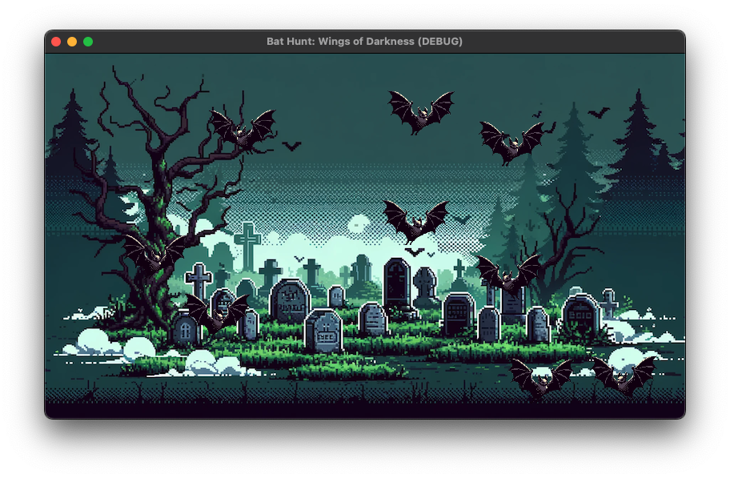

# Bat Hunt: Wings of Darkness

[日本語で読む](README.md)

## Story

In the deep of night, a legend awakens. Once every thousand years, when the moonlight touches the Dark Crystal, the dark bats known as "Shadow Bats" emerge into our world. You have been chosen as the descendant of the Luna Hunters, entrusted with the mission to pursue these creatures lurking in the darkness and save the world.

In "Bat Hunt: Wings of Darkness", you embark on a silent hunt under the moonlight. Armed with the mystical Moonlight Lantern, your mission is to illuminate the darkness, find the swarms of bats, and drive them away.

However, with each passing night, the bats become wiser and faster, making the challenge increasingly difficult. Upgrade your lantern, utilize clever strategies and sharp insights to seal the full power of the Dark Crystal. Your decisions will determine whether the world remains in light or succumbs to darkness.

In this grand hunt, the ultimate confrontation awaits you – a final battle with the guardian of the Dark Crystal. The power to preserve the light and banish the darkness lies within you. End the threat of the Shadow Bats and restore peace to the world.

In "Bat Hunt: Wings of Darkness", embrace your destiny as a legendary hunter.

## Screenshot

## Credits

### Images

- Explosion Effects: `assets/images/explosion.png`
  - Source: 【Godot Engine】クリックゲームチュートリアル - YouTube ([Link](https://www.youtube.com/watch?v=mvqxnvuAlEc&t=1s))

### Fonts

- Xolonium: `assets/fonts/Xolonium-Regular.ttf`
  - Source: Xolonium Font \| dafont.com ([Link](https://www.dafont.com/xolonium.font))
