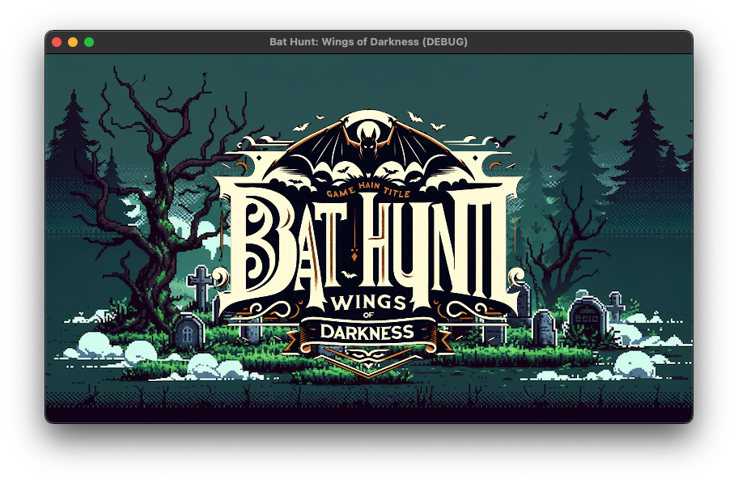
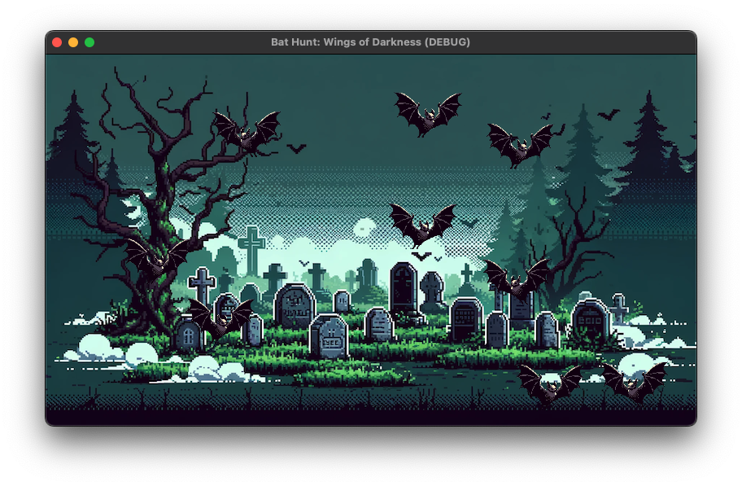

# Bat Hunt: Wings of Darkness

## ストーリー

深夜、一つの伝説が目を覚ます。千年に一度、月の光がダーククリスタルに触れるとき、暗黒のコウモリ「シャドウバッツ」がこの世に現れます。あなたはルナハンターの末裔として選ばれ、暗闇に潜むこれらの生き物を追い詰め、世界を救う使命を担っています。

「Bat Hunt: Wings of Darkness」では、月明かりの下で繰り広げられる静かな狩りの中で、プレイヤーはシャドウバッツを追い詰めます。神秘的な力を持つムーンライトランタンを手に、暗闇を照らし出し、コウモリの群れを見つけ出すことが、あなたの使命です。

しかし、夜ごとにコウモリは賢く、素早くなり、挑戦はより困難になります。ランタンをアップグレードし、巧みな戦略と鋭い洞察力を駆使して、ダーククリスタルの完全なる力を封じるのです。あなたの決断が、世界を光か闇かの運命に導きます。

この壮大な狩りの中で、最後に待ち受けるのは、ダーククリスタルの守護者との究極の対決です。光を守り、闇を消し去る力は、あなたの内にあります。シャドウバッツの脅威を終わらせ、世界に平和を取り戻しましょう。

「Bat Hunt: Wings of Darkness」で、伝説のハンターとしての運命に立ち向かいましょう。

## プレイ画像

